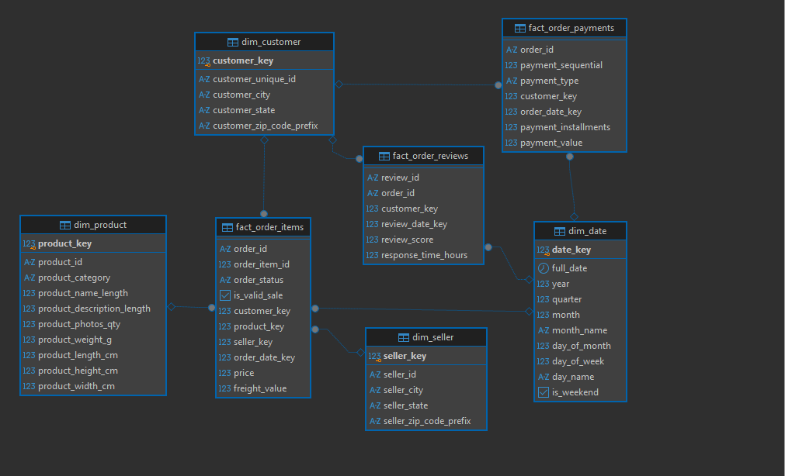
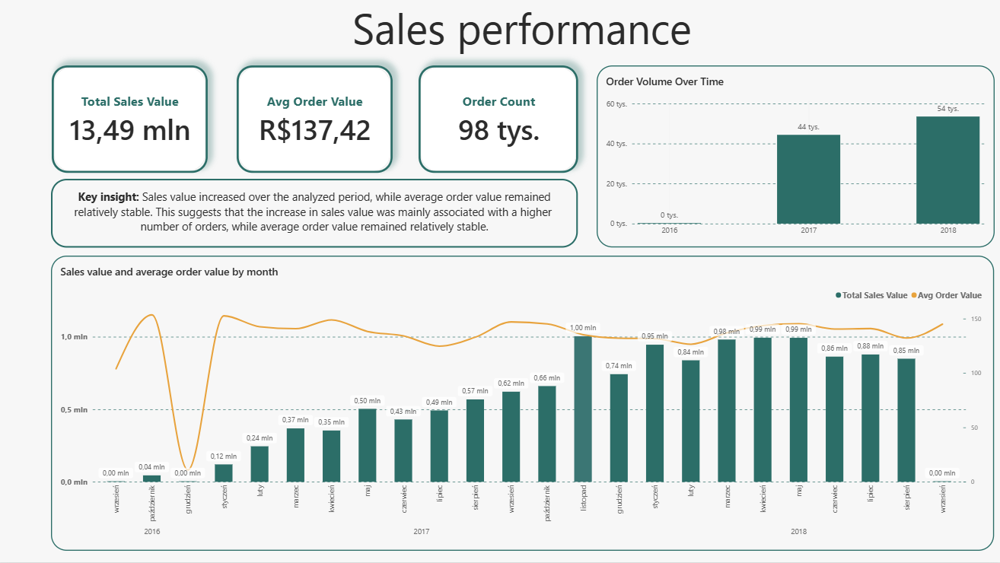
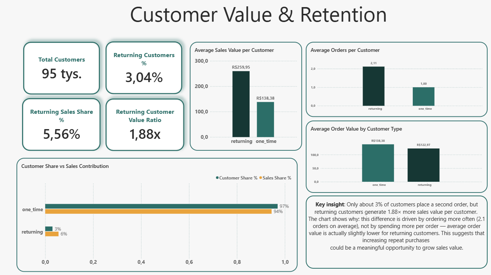
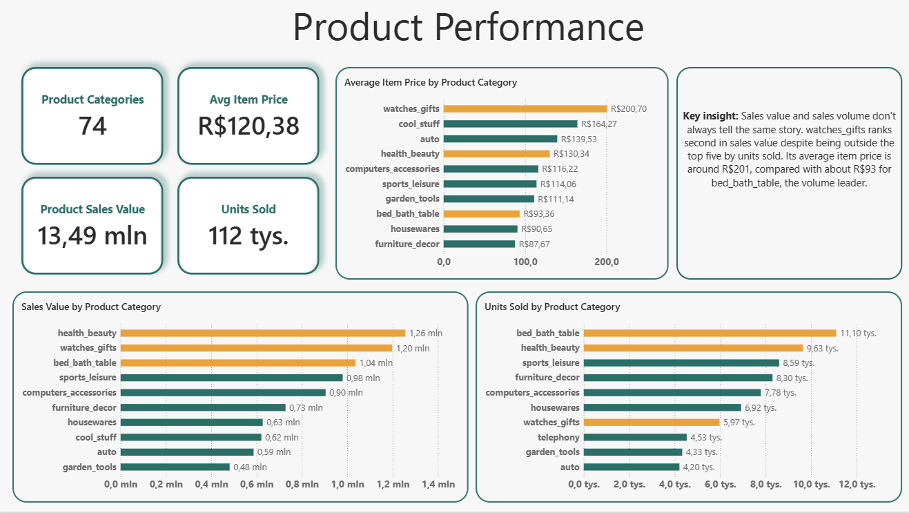
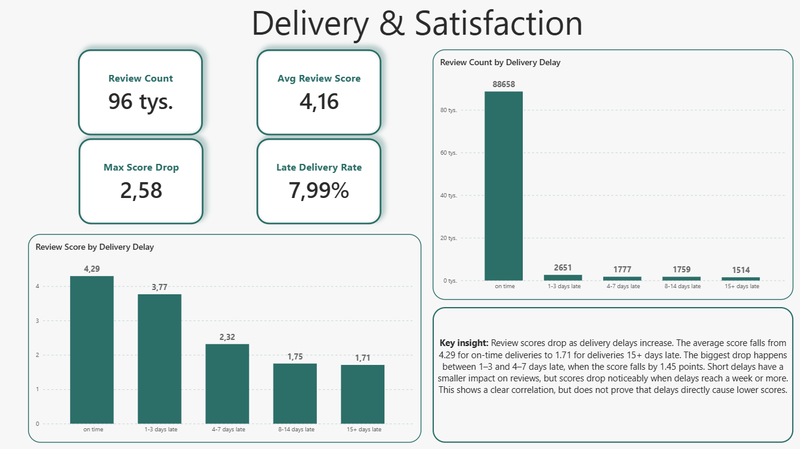

# Olist Marketplace Analysis (SQL + Power BI)

## Project Overview

End-to-end analysis of a real e-commerce marketplace, focused on one question: does sales growth go together with customer experience quality.

- **Goal:** build a validated analytical model from real transactional data and use it to connect sales performance, customer retention, product mix, and delivery quality.
- **Stack:** SQL (PostgreSQL), Power BI.
- **Pipeline:** Source files → RAW → STG → MART → Analysis views → Power BI.
- **Output:** interactive Power BI report (.pbix) + a reproducible SQL analytical layer.

[**Power BI Report (.pbix)**](./powerbi/Olist_ecommerce_analysis.pbix) | [**SQL**](./sql) | [**DAX Measures**](./DAX/measures.md) | [**Data**](./data)

**Data Source:** Public, real-world e-commerce dataset from Olist, a marketplace connecting small and medium sellers with customers across Brazil. The dataset contains anonymized order-level data from 2016 to 2018 and was originally split across 9 relational tables.

## Business Questions

This project looks at one main problem: a marketplace can increase the number of orders while customer experience gets worse. Sales growth alone does not show the full picture. The analysis is divided into four areas.

- **Sales performance**
  - Is revenue growth driven by more orders, larger orders, or both?
  - How stable is order value over time?

- **Customer value and retention**
  - What share of customers place more than one order?
  - Are returning customers worth more, and if so, is this caused by order frequency or higher spending per order?

- **Product performance**
  - Which product categories drive revenue, and which drive volume?
  - Do the same categories lead both rankings, or are high-value categories different from high-volume categories?

- **Delivery and satisfaction**
  - What share of orders arrive late?
  - Does delivery delay relate to customer review scores, and at what point does the relationship become stronger?

## Data & Model

### Dataset

The dataset contains order-level data for an online marketplace, including orders, order items, payments, customer reviews, products, customers, and sellers. The source data comes as several related tables rather than one pre-joined file, which makes the project closer to working with a real operational database.

### Pipeline

The pipeline follows a layered warehouse structure.

- **RAW**
  - source files are loaded into landing tables without transformation
  - every column is stored as `TEXT` to preserve the source values and keep the layer traceable
  - validated with row count checks, missing/empty key checks, and referential integrity checks between orders, customers, order items, products, sellers, and payments

- **STG**
  - raw fields are trimmed, standardized, and cast into proper types (`DATE`, `TIMESTAMP`, `NUMERIC`, `INTEGER`)
  - identifier fields such as zip code prefixes are kept as `TEXT`, because roughly 24% have a leading zero that would be lost in a numeric column
  - grain is preserved from RAW, with no joins and no business logic at this stage

- **MART**
  - modeled as a star schema, built as a fact constellation because the data covers three business processes at different grains: sales, payments, and reviews
  - the customer identity problem in the source data, where a new `customer_id` is generated per order, is handled in `dim_customer` using an SCD Type 1 approach based on `customer_unique_id`
  - the product category hierarchy is flattened into one `dim_product`
  - all order items are kept in the fact table, with a boolean flag showing which ones count as valid sales

- **Analysis**
  - one standalone SQL view per dashboard page, using only additive measures such as `SUM` and `COUNT`
  - ratios, averages, and percentages are calculated in Power BI with DAX, so they stay correct when filters are applied

### Star Schema

- **`fact_order_items`**
  - grain: 1 row = 1 order item
  - measures: `price`, `freight_value`
  - flag: `is_valid_sale` (TRUE for all statuses except `canceled` and `unavailable`)

- **`fact_order_payments`**
  - grain: 1 row = 1 payment record per order
  - measures: `payment_value`, `payment_installments`

- **`fact_order_reviews`**
  - grain: 1 row = 1 review
  - measure: `review_score`
  - derived field: `response_time_hours`

- **dimensions**
  - `dim_date`, `dim_customer`, `dim_product`, `dim_seller`

This structure keeps transaction data separate from descriptive attributes. All three fact tables share the same dimensions, so results from different pages can be compared consistently.

### Engineering Model

*SQL engineering model for the mart layer: three fact tables (sales, payments, reviews) sharing the same conformed dimensions.*

### Validation

Every layer is checked before the next one is built.

- **RAW checks**
  - row counts after load, compared against the source files
  - missing or empty key fields (`order_id`, `customer_id`, `product_id`, `seller_id`)
  - referential integrity between orders and customers, order items and products/sellers, and payments and orders, using left joins and orphan counts

- **STG checks**
  - row count parity against RAW after casting
  - spot checks on cast fields to confirm that values were not silently changed or dropped

- **MART checks**
  - row count parity between STG and each fact table
  - null foreign key checks across all three fact tables
  - orphan key checks against every dimension
  - measure checks: no negative price, freight, or payment values, and review scores within the valid 1 to 5 range

All checks pass with zero issues (see `sql/validation/mart_validation.sql`).

### Data Quality Notes

- 610 of 32,951 products (1.85%) have no category recorded in the source, and 2 category names have no English translation in the reference table. Both cases are preserved through a left join and resolved with a fallback value instead of being silently dropped.
- The `geolocation` table has multiple rows per zip code prefix and is not used in this version of the model, since joining it directly would duplicate fact rows.
- 3 payment records have a `not_defined` payment type and a zero value. They are statistically immaterial and were left unchanged.
- No product cost data exists in the source, so margin and profitability could not be calculated. The product analysis covers revenue and volume only.
- `freight_value` was excluded from the product-level analysis because the source data does not clearly show who absorbs shipping costs above a certain order value.

## SQL Views and DAX Used in the Dashboard

- **Page 1. Sales Performance** — `analysis.vw_sales_monthly`
- **Page 2. Customer Value & Retention** — `analysis.vw_customer_value`
- **Page 3. Product Performance** — `analysis.vw_product_performance`
- **Page 4. Delivery & Satisfaction** — `analysis.vw_delivery_satisfaction`

DAX is used for every ratio and percentage, and for filter-aware comparison KPIs such as the on-time versus severely-late review score gap.

## The Analysis

### Page 1. Sales Performance

*This page sets the baseline for the report: how much the business sells, and whether growth comes from more orders or bigger orders.*

- Across the full period, the business generated **R$13.49M in sales** from **98,199 orders**, at an average order value of **R$137.42**.
- Order volume grew strongly year over year, from a partial 2016 to about **44,000 orders in 2017** and **54,000 in 2018**.
- The monthly trend shows a clear pattern: sales dropped close to zero in December 2016, recovered sharply in January 2017, then grew through 2017 before becoming more stable in 2018.
- Average order value stayed fairly stable, moving in a narrow range of roughly R$100 to R$150 a month, while order volume increased.

The growth pattern shows that sales growth over the analyzed period came mainly from more orders rather than higher spending per order.

### Page 2. Customer Value & Retention

*This page asks whether customers who come back are worth more, and if so, why.*

- Of roughly **95,000 customers**, only **3.04%** place a second order.
- Returning customers generate **5.56%** of total sales value and are worth **1.88 times** more per customer than one-time customers (**R$259.95** versus **R$138.38**).
- Returning customers place **2.11 orders on average** versus 1.00 for one-time customers, while their average order value is slightly lower (**R$122.97** versus **R$138.38**). The value gap is therefore mainly driven by ordering more often, not by spending more per order.

Repeat purchasing is rare in this dataset, but returning customers have higher value because they order more often. A retention campaign after the first order could be tested to increase repeat purchases.

### Page 3. Product Performance

*This page compares product categories by revenue and by volume, since the two rankings do not always agree.*

- The catalog spans **74 product categories**, generating **R$13.49M** in sales from **112,000 units sold**, at an average item price of **R$120.38**.
- `health_beauty` leads by revenue (**R$1.26M**), narrowly ahead of `watches_gifts` (**R$1.20M**) and `bed_bath_table` (**R$1.04M**).
- The volume ranking tells a different story. `bed_bath_table` leads by units sold (**11,100**), while `watches_gifts` has **5,970 units**, outside the top five.
- The gap is mainly explained by price. `watches_gifts` has an average item price of **R$200.70**, more than double `bed_bath_table` at **R$93.36**.

Revenue and volume do not show the same category leaders. High-value and high-volume categories may therefore need different approaches.

### Page 4. Delivery & Satisfaction

*This page tests the main customer experience question: does delivery performance relate to how customers rate their orders?*

- Across **96,359 reviews** tied to a completed delivery, the average review score is **4.16**, and **7.99%** of deliveries arrived after their estimated delivery date.
- Average score falls from **4.29** for on-time deliveries to **3.77** for 1 to 3 days late, **2.32** for 4 to 7 days late, **1.75** for 8 to 14 days late, and **1.71** for deliveries 15 or more days late. This is a total drop of **2.58 points**.
- The biggest single drop (**-1.45 points**) happens between the 1-3 day and 4-7 day buckets. This suggests that customer satisfaction falls more sharply when delays reach several days.
- This is a correlation observed in the data, not proof that delivery delays directly cause lower scores.

The relationship is strong enough to justify further investigation. Delivery performance appears to be closely linked with customer experience in this dataset.

## Strategic Recommendations

- **Focus on order volume as the main growth driver**

  Sales growth over the analyzed period came mainly from more orders, while average order value stayed fairly stable. A cross-sell or bundling test could show whether basket size can also be increased.

- **Test a retention step after the first order**

  Only 3.04% of customers place a second order, while returning customers have higher value because they order more often. A reminder or incentive campaign after the first purchase could be tested to increase repeat purchases.

- **Use different approaches for high-value and high-volume categories**

  `watches_gifts` ranks second in sales value despite being outside the top five by units sold. Its average item price is more than double that of `bed_bath_table`, the volume leader. Category-level pricing, promotion, or placement tests could help identify the best approach for each group.

- **Investigate delays before they reach 4–7 days**

  Review scores remain relatively high for on-time deliveries and short delays, but fall sharply in the 4–7 day bucket. Since 7.99% of deliveries arrived late, reducing longer delays is a clear area for further operational analysis and testing.

## Technical Highlights

### SQL / PostgreSQL

- built a layered pipeline: RAW → STG → MART → Analysis
- used window functions (`ROW_NUMBER() OVER (PARTITION BY ...)`) to resolve a many-to-one source identifier problem during dimension modeling
- applied safe null handling (`NULLIF`, `COALESCE`) to avoid losing or misrepresenting incomplete source records
- validated referential integrity at every layer using left joins and orphan counts, not just row counts
- used transactional DDL (`BEGIN` / `COMMIT`) so each table rebuild is atomic

### Data Modeling

- designed a star schema as a fact constellation, with three fact tables at three different grains sharing the same conformed dimensions
- resolved a real-world identity problem (`customer_id` versus `customer_unique_id`) with an explicit SCD Type 1 decision, documented in the SQL comments
- kept every analysis view additive-only, moving every ratio and percentage calculation into DAX to keep results correct under filtering

### Power BI

- connected Power BI to purpose-built SQL analysis views rather than the raw star schema tables
- used `DIVIDE` consistently instead of the `/` operator to avoid divide-by-zero errors across all ratio measures
- used `CALCULATE` with explicit filter conditions and `ALLSELECTED` / `REMOVEFILTERS` for share-of-total and segment-comparison KPIs
- kept each page focused on one business question with a short, data-backed takeaway rather than maximizing the number of visuals

## Closing Thoughts

This project combines SQL data modeling and Power BI reporting into one validated analytical workflow, built end to end on real transactional data rather than a pre-cleaned, pre-joined dataset. The result is a four-page report that connects sales growth, customer retention, product mix, and delivery quality into one data-backed view of the business.
